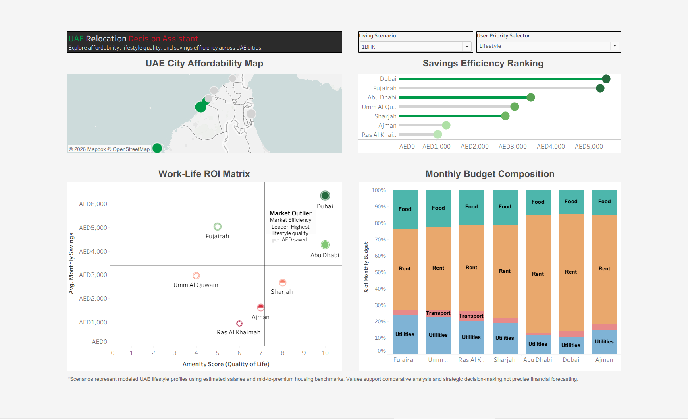

# UAE Relocation Intelligence Dashboard

## Project Overview
This project is an interactive Tableau dashboard designed to analyze relocation trade-offs across UAE cities using affordability, savings efficiency, lifestyle quality, and budget allocation metrics.

The dashboard simulates multiple living scenarios and helps users evaluate which UAE city best aligns with their financial and lifestyle priorities.

---

## Key Features
- Dynamic scenario-based analysis (1BHK, Shared, Family)
- Savings Efficiency Ranking
- Work-Life ROI Matrix
- UAE City Affordability Map
- Monthly Budget Composition Analysis
- Interactive parameter-driven recommendation logic
- Strategic relocation insights and narrative tooltips

---

## Tools Used
- Tableau Public
- Excel
- Data Modeling
- Business Intelligence & Data Visualization

---

## Dashboard Preview

---

## Live Dashboard
[View on Tableau Public](https://public.tableau.com/views/UAE_Relocation_Intelligence_Dashboard/UAERelocationIntelligenceDashboard?:language=en-GB&:sid=&:redirect=auth&:display_count=n&:origin=viz_share_link)

---

## Dataset Notes
Scenarios represent modeled UAE lifestyle profiles using estimated salaries and mid-to-premium housing benchmarks. Values support comparative analysis and strategic decision-making, not precise financial forecasting.
